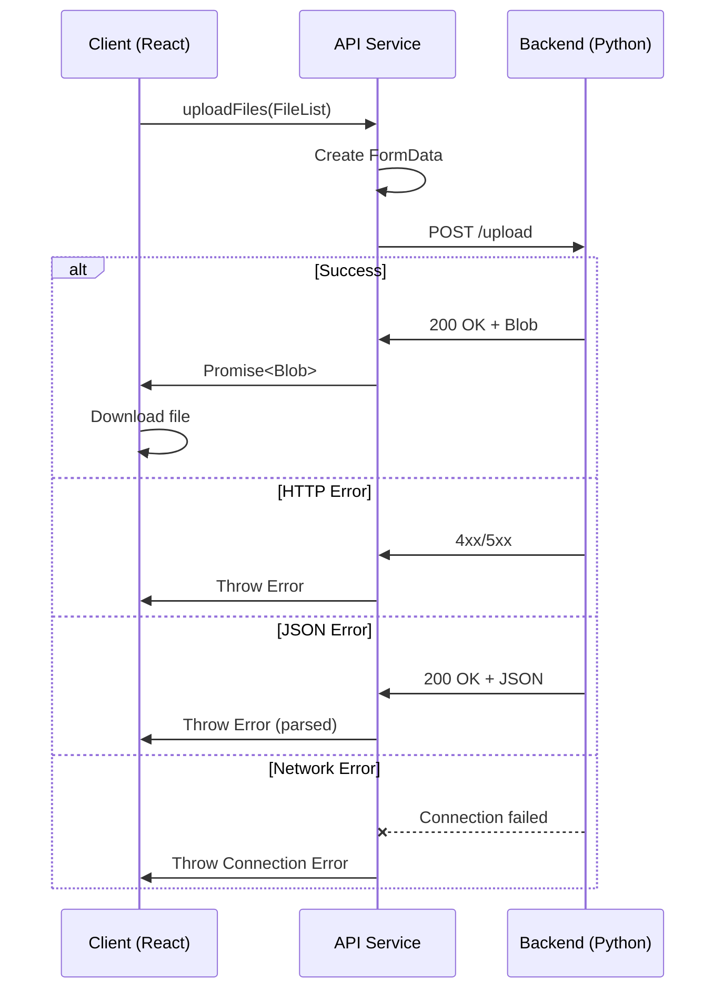

## Overview

MkDowner uses a centralized API service to communicate with the Python backend. The service handles file uploads, error handling, and response processing.

## API Service

### Location

`src/services/api.ts`

### Full Implementation

```typescript
const API_BASE_URL = import.meta.env.VITE_API_BASE_URL;

export const uploadFiles = async (files: FileList): Promise<Blob> => {
  try {
    const formData = new FormData();
    
    for (let i = 0; i < files.length; i++) {
      formData.append('files', files[i]);
    }

    const response = await fetch(`${API_BASE_URL}/upload`, {
      method: 'POST',
      body: formData,
    });

    if (!response.ok) {
      throw new Error(`HTTP ${response.status}: ${response.statusText}`);
    }

    const contentType = response.headers.get('content-type');
    if (contentType && contentType.includes('application/json')) {
      const errorData = await response.json();
      throw new Error(errorData.error || 'Server returned JSON instead of file');
    }

    return response.blob();
  } catch (error) {
    if (error instanceof TypeError && error.message.includes('fetch')) {
      throw new Error('Cannot connect to server. Make sure backend is running on ' + API_BASE_URL);
    }
    throw error;
  }
};
```

## Environment Configuration

The API service reads the backend URL from environment variables:

```typescript
const API_BASE_URL = import.meta.env.VITE_API_BASE_URL;
```

### Configuration File

Create a `.env` file in the project root:

```bash
VITE_API_BASE_URL=http://localhost:5001
```

<Warning>
  The backend must be running on the configured URL before making API calls. The service will throw a connection error if the backend is unreachable.
</Warning>

## uploadFiles Function

### Signature

```typescript
uploadFiles(files: FileList): Promise<Blob>
```

### Parameters

| Parameter | Type | Description |
|-----------|------|-------------|
| `files` | `FileList` | Files to upload (from `<input type="file">`) |

### Return Value

Returns a `Promise<Blob>` containing the converted file(s):
- **Single file**: Markdown file (.md)
- **Multiple files**: ZIP archive containing all converted files

### Implementation Details

#### 1. FormData Construction

The function creates a FormData object and appends all files:

```typescript
const formData = new FormData();

for (let i = 0; i < files.length; i++) {
  formData.append('files', files[i]);
}
```

<Note>
  All files are appended with the same key `'files'` to support multiple file uploads. The backend should expect an array of files under this key.
</Note>

#### 2. HTTP Request

Makes a POST request to the `/upload` endpoint:

```typescript
const response = await fetch(`${API_BASE_URL}/upload`, {
  method: 'POST',
  body: formData,
});
```

**Headers**: Not manually set (browser automatically sets `Content-Type: multipart/form-data` with boundary)

#### 3. Response Validation

Checks for HTTP errors:

```typescript
if (!response.ok) {
  throw new Error(`HTTP ${response.status}: ${response.statusText}`);
}
```

#### 4. Content Type Check

Validates that the response is a file (not JSON error):

```typescript
const contentType = response.headers.get('content-type');
if (contentType && contentType.includes('application/json')) {
  const errorData = await response.json();
  throw new Error(errorData.error || 'Server returned JSON instead of file');
}
```

This handles cases where the backend returns an error as JSON instead of a file.

#### 5. Blob Return

Converts the response to a Blob:

```typescript
return response.blob();
```

## Error Handling

The service implements comprehensive error handling:

### Connection Errors

```typescript
if (error instanceof TypeError && error.message.includes('fetch')) {
  throw new Error('Cannot connect to server. Make sure backend is running on ' + API_BASE_URL);
}
```

Detects network failures and provides a user-friendly message.

### HTTP Errors

```typescript
if (!response.ok) {
  throw new Error(`HTTP ${response.status}: ${response.statusText}`);
}
```

Throws errors for 4xx and 5xx status codes.

### Backend Errors

```typescript
if (contentType && contentType.includes('application/json')) {
  const errorData = await response.json();
  throw new Error(errorData.error || 'Server returned JSON instead of file');
}
```

Parses JSON error responses from the backend.

## Backend Endpoints

The backend must implement the following endpoints:

### POST /upload

Converts uploaded files to Markdown format.

#### Request

**Method**: `POST`  
**Content-Type**: `multipart/form-data`  
**Body**: FormData with `files` field containing one or more files

```http
POST /upload HTTP/1.1
Host: localhost:5001
Content-Type: multipart/form-data; boundary=----WebKitFormBoundary

------WebKitFormBoundary
Content-Disposition: form-data; name="files"; filename="document.pdf"
Content-Type: application/pdf

[binary file data]
------WebKitFormBoundary--
```

#### Response (Success)

**Single file**:
```http
HTTP/1.1 200 OK
Content-Type: text/markdown
Content-Disposition: attachment; filename="document.md"

[markdown content]
```

**Multiple files**:
```http
HTTP/1.1 200 OK
Content-Type: application/zip
Content-Disposition: attachment; filename="converted_files.zip"

[zip binary data]
```

#### Response (Error)

```http
HTTP/1.1 400 Bad Request
Content-Type: application/json

{
  "error": "Invalid file format"
}
```

### POST /md-to-word

Converts Markdown files to Word format (used by PandocConverter component).

#### Request

```http
POST /md-to-word HTTP/1.1
Host: localhost:5001
Content-Type: multipart/form-data

[FormData with files]
```

#### Response

```http
HTTP/1.1 200 OK
Content-Type: application/vnd.openxmlformats-officedocument.wordprocessingml.document
Content-Disposition: attachment; filename="document.docx"

[docx binary data]
```

## Usage Example

Here's how the API service is used in the `useFileUpload` hook:

```typescript
import { uploadFiles } from '../services/api';

const handleUpload = async (files: FileList) => {
  setIsUploading(true);
  setProgress(0);

  try {
    // Call API service
    const blob = await uploadFiles(files);
    
    // Download the result
    const fileName = files.length === 1 ? 
      `${files[0].name.split('.')[0]}.md` : 
      'converted_files.zip';
    
    const url = window.URL.createObjectURL(blob);
    const a = document.createElement('a');
    a.href = url;
    a.download = fileName;
    document.body.appendChild(a);
    a.click();
    window.URL.revokeObjectURL(url);
    document.body.removeChild(a);

    setIsUploading(false);
    setShowSuccess(true);

  } catch (error) {
    setIsUploading(false);
    alert(`Upload failed: ${error instanceof Error ? error.message : 'Unknown error'}`);
  }
};
```

## Request/Response Flow



## TypeScript Types

The API service uses built-in browser types:

```typescript
// Input
FileList: DOM interface for file input elements

// Output
Blob: Binary Large Object for file data

// Error
Error: Standard JavaScript error object
```

## Best Practices

<AccordionGroup>
  <Accordion title="Error Messages">
    The service provides context-specific error messages:
    - Network errors mention the backend URL
    - HTTP errors include status codes
    - Backend errors use the server's error message
  </Accordion>
  
  <Accordion title="Content Type Validation">
    Always check the response Content-Type header to distinguish between:
    - Success responses (file blobs)
    - Error responses (JSON)
  </Accordion>
  
  <Accordion title="Environment Variables">
    Use Vite's `import.meta.env` for configuration:
    ```typescript
    const API_BASE_URL = import.meta.env.VITE_API_BASE_URL;
    ```
    All custom env vars must be prefixed with `VITE_`.
  </Accordion>
  
  <Accordion title="FormData Best Practices">
    - Don't set Content-Type header manually
    - Browser automatically adds boundary parameter
    - Use the same field name for multiple files
  </Accordion>
</AccordionGroup>

## Testing the API

Test the backend endpoint using curl:

```bash
curl -X POST http://localhost:5001/upload \
  -F "files=@document.pdf" \
  -o output.md
```

For multiple files:

```bash
curl -X POST http://localhost:5001/upload \
  -F "files=@document1.pdf" \
  -F "files=@document2.docx" \
  -o output.zip
```

## Troubleshooting

<AccordionGroup>
  <Accordion title="CORS Errors">
    If you see CORS errors, ensure the backend allows requests from your frontend origin:
    
    ```python
    # Flask example
    from flask_cors import CORS
    CORS(app, origins=['http://localhost:5173'])
    ```
  </Accordion>
  
  <Accordion title="Connection Refused">
    Error: "Cannot connect to server"
    
    **Solution**: Verify the backend is running:
    ```bash
    curl http://localhost:5001/health
    ```
  </Accordion>
  
  <Accordion title="File Download Not Working">
    Ensure the response includes proper headers:
    ```python
    return send_file(
        file_path,
        as_attachment=True,
        download_name='converted.md'
    )
    ```
  </Accordion>
</AccordionGroup>

## See Also

- [Custom Hooks](/development/hooks) - useFileUpload implementation
- [Development Setup](/development/setup) - Environment configuration